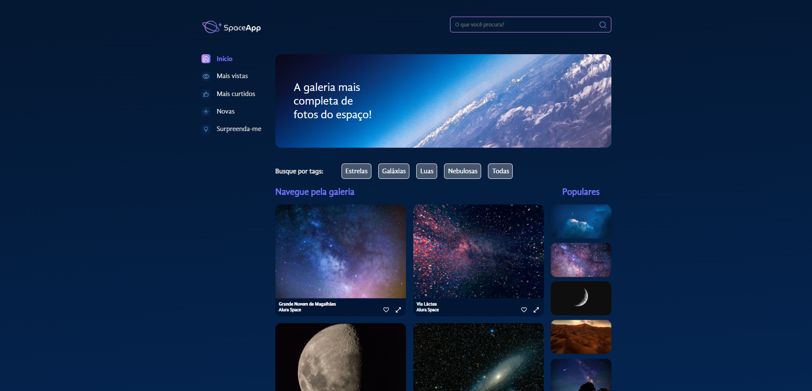
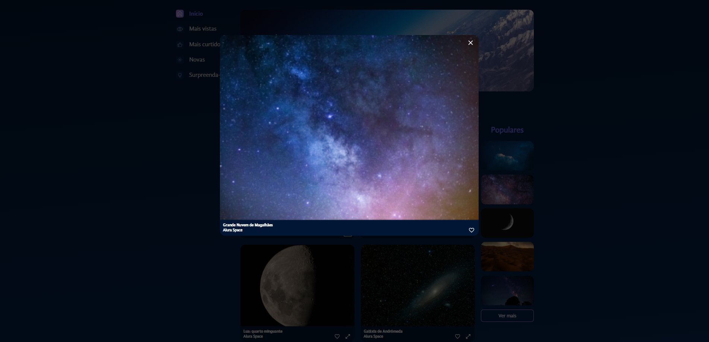

# Projeto Space-app

Projeto desenvolvido durante o curso de React: estilize componentes com Styled Components e manipule arquivos estáticos

# Principais tecnologias utilizadas no projeto
* React
* NodeJs
* Styled-Components

# Imagens do projeto

Parte contendo o contéudo principal do projeto

Parte contendo uma das funções feitas no projeto